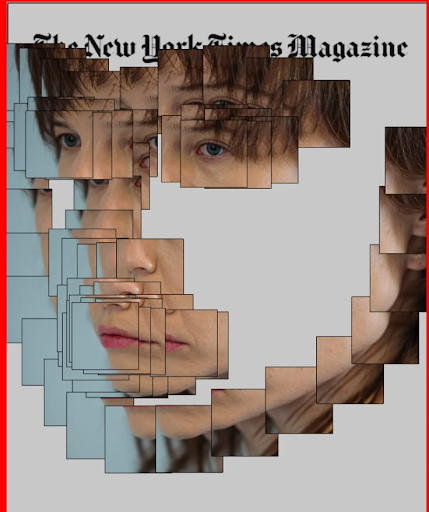
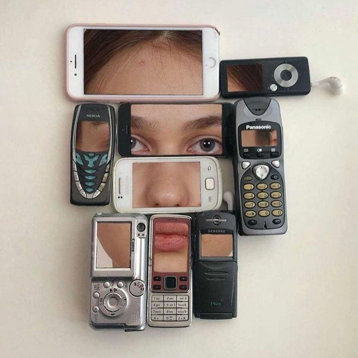
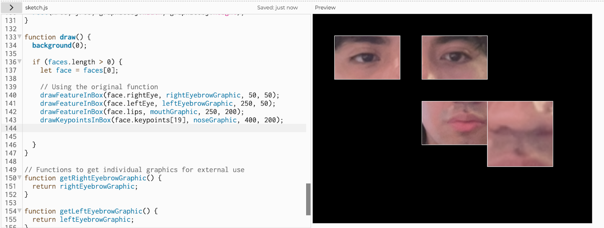
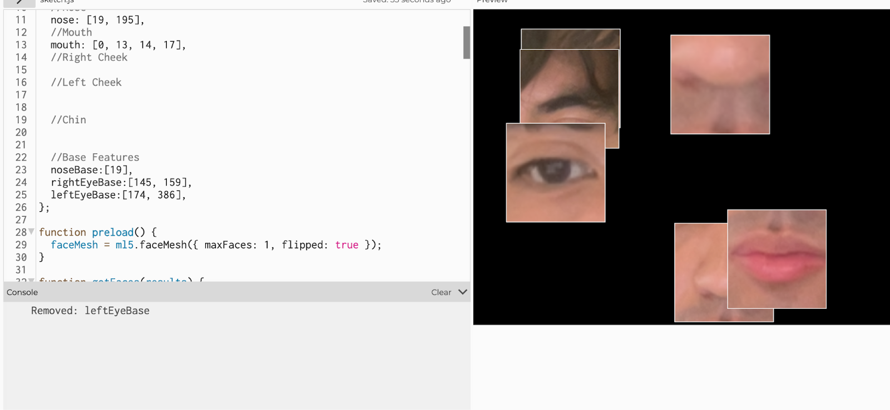
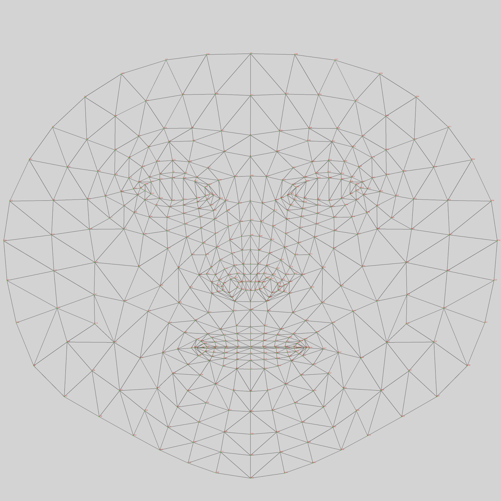
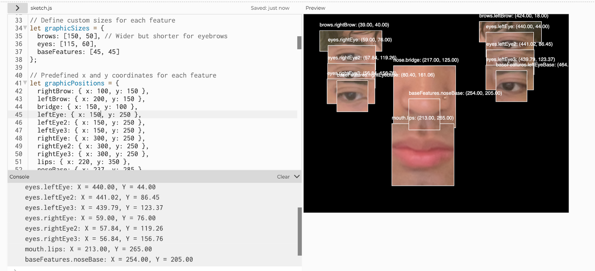
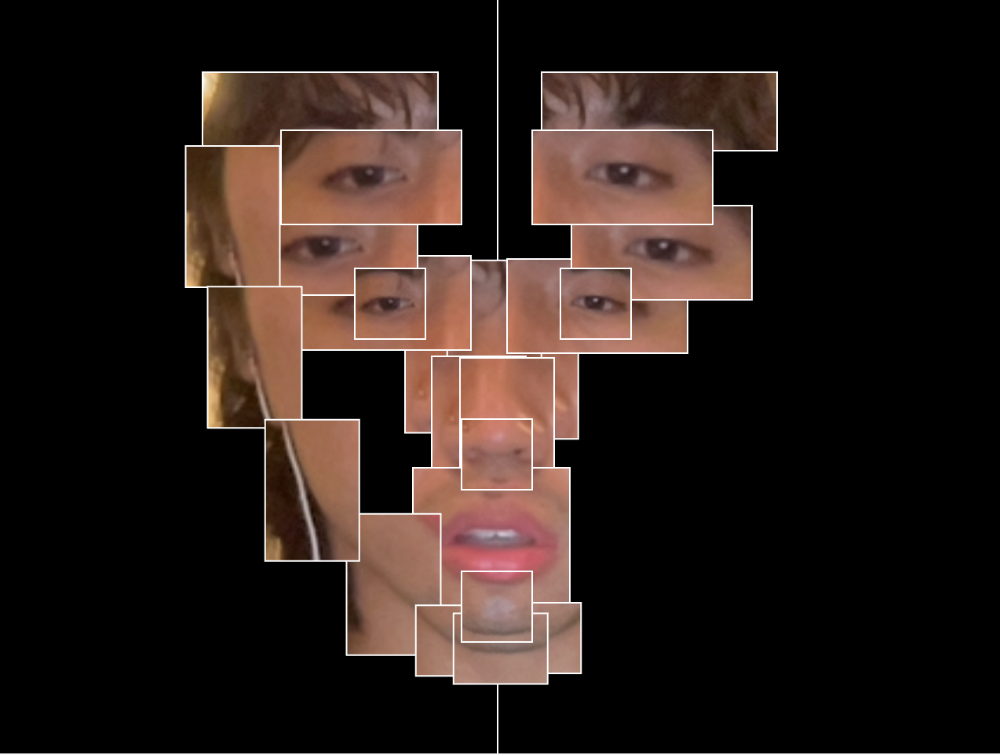
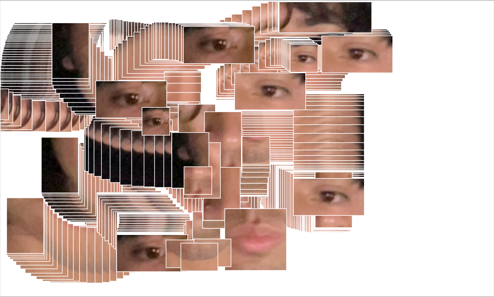

# Refor(me)d

**Description: **An ensemble of windows that work coherently to produce a portrait of the current user. The user can drag and drop themselves in their own image.

## Origin:

My initial inspiration for this project was an image I saw on Pinterest. It featured work by Zach Liberman, specifically *his Coded Illustrations* for the New York Times. I enjoyed the use of repeating facial features to create something weird and expressive. 

Zach Liberman, a teacher at the MIT Media Lab, explained his ideation/experimentation process while writing the code for this project. At the very end, he wishes for “more illustration and editorial work from the p5js and other creative coding communities.” 

I was truly inspired by this and with my experience working with handPose in ml5.js, I thought that the only natural progression was for me to move to working with faceMesh. 

I began thinking about the creative angle I wanted to approach with this project, I liked the original but I wanted a way to make this project more of my own. My thoughts went to the container that the graphics would be in, in the original the graphics stand-alone, only surrounded by a black border, which makes the portrait more cohesive.

I thought about different ways I could split up the windows and what it meant to place these features in these windows. What I gained from this was how graphical window size affected the presentation of the features, in the photo below the nose area is presented in a horizontally wide rectangle, but in the original, all containers are the same size.

These images represent the different containers that the graphical windows could present themselves as, there were degrees of flexibility when it came to implementing this project idea that I had to acknowledge.

## Initial Ideation:

I began first by implementing ml5.js, and its faceMesh feature, then stored the faces into an array. I relied on ChatGPT to make a boilerplate for my code, I prompted it to create graphical windows that would feature key points from the faceMesh. Each part of the face has a key point associated with it, so by referencing this key point we can render an image with just the facial feature we want inside it. ChatGPT created a function doing just so.

In the previously provided image, I was using predefined keypoints associated with keywords called features, in ml5.js, eyes, and lips are predefined so the only thing I was creating as a result of keypoints was the tip of my nose.

I then began storing features with keypoints, and experimenting with what different combinations of keypoints looked the best. I scoured the internet for a good resource that had the points clearly imaged, often I’d find references to the key points but it would make the numbers for the keypoints difficult to see.

You can’t see in the doc, but at each intersection of triangle polygon there is a keypoint.

This is the tensorflow.js face landmarks detection, keypoints master. I found out that the ml5.js library had been built using tensorflow.js 

resources.

## Prototyping:

I then thought of ways that I could speed up the process when it came to coming up with the imitation. Preset positions for the different features, was one of the things I was using in order to recreate the image, but moving things pixel by pixel was aggravatingly slow, and inaccurate. I even had the values displayed, along with a list of the x & y positions in order to speed things up.

At this point I was storing all the keypoints in an array, the sizes for these features in another array, and the graphic positions in a final array. I had to up the abstraction when it came to keypoints, because I wanted a better way to differentiate between these keypoint groups, so it went nose->noseBridgeLeft, nose->noseBridgeRight.

I eventually asked ChatGPT to help me make these graphical windows drag and droppable to speed up the process, but little did I know that this made my imitation into something different. The drag-and-droppable nature of the windows turned it into a fun tool! I also added a double click to remove functionality, that outputted the part u removed in the console.

With the addition of these debugging tools, I was able to finalize what I wanted the preset face to look like.

I chose to not implement the right side, that way the user could tilt their head and it would display the way that the images resized to ensure your features were properly captured in the window. I then moved to add a side bar that lets you add windows with default parts, eyes, nose, and mouth. I also made the background toggleable with the ‘2’ key, making it so that the windows will stay on screen as they are being redrawn everytime the draw() function is called in order to make it drag and droppable.

This leads to something that looks like this. 

I am overall very happy with how it turned out, and I think that it pays homage to the original while also being a fun tool in itself.

## Credits:

[https://github.com/tensorflow/tfjs-models/blob/master/face-landmarks-detection/mesh_map.jpg](https://github.com/tensorflow/tfjs-models/blob/master/face-landmarks-detection/mesh_map.jpg)

faceMesh map

ChatGPT for making the boiler plate, drag and droppable class, etc.

[https://ml5js.org/](https://ml5js.org/)

FaceMesh from ml5

[https://youtu.be/R5UZsIwPbJA?si=ikg8mDe9QVcetMJs](https://youtu.be/R5UZsIwPbJA?si=ikg8mDe9QVcetMJs)

Facemesh video by coding train

[https://medium.com/mit-media-lab/coded-illustrations-bebdf385cd98](https://medium.com/mit-media-lab/coded-illustrations-bebdf385cd98)

Coded Illustration by Zach Lieberman
